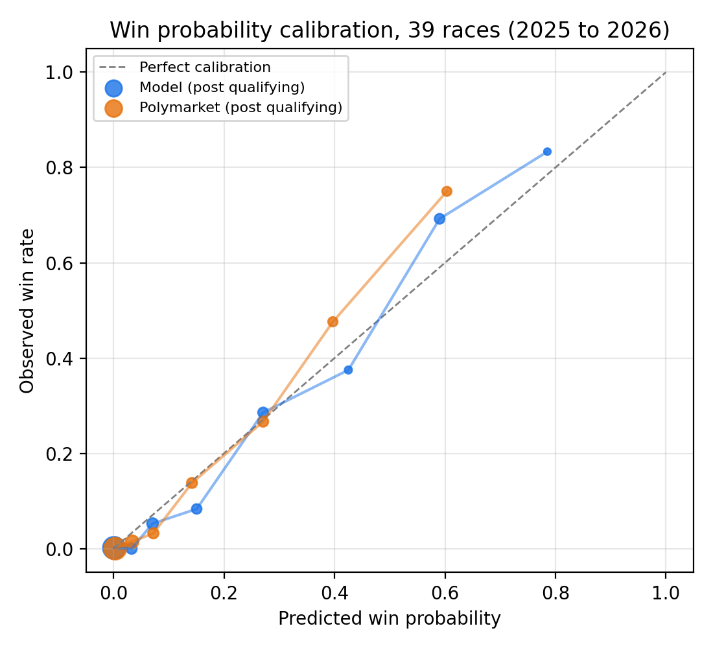
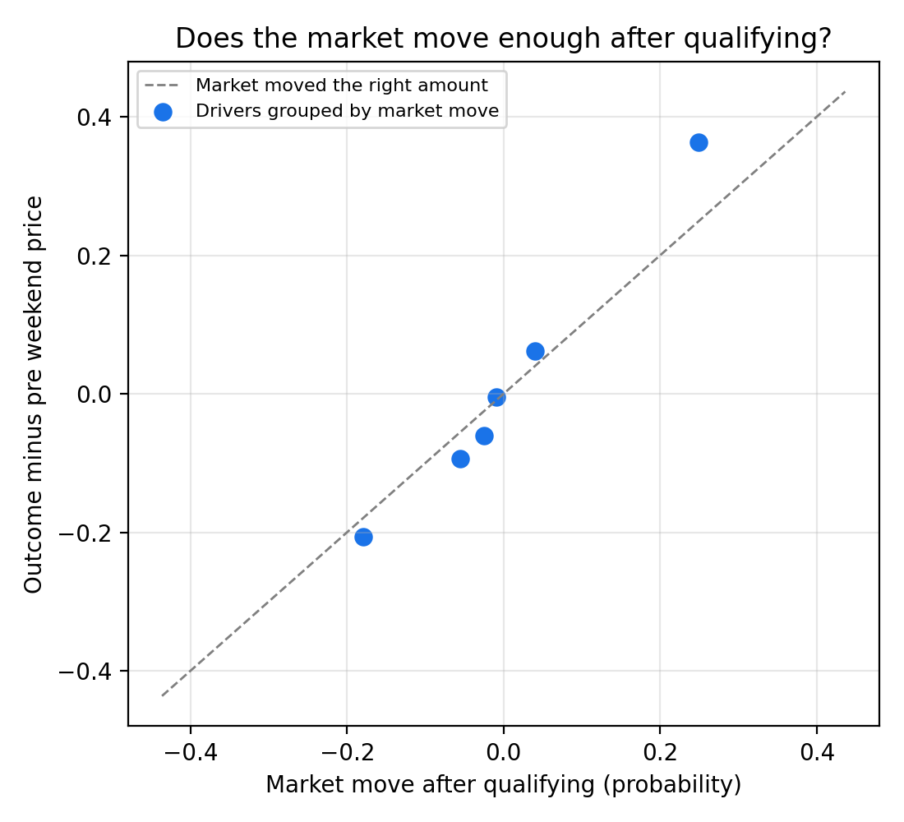

# Pricing Formula 1 Race Winners: A Race Model vs. Polymarket


**Question.** Can a simple race model built from qualifying pace, grid position, and team reliability price F1 race winner markets as well as a prediction market trading $1M or more per race? And when qualifying reveals new information, does the market move its prices by the right amount?

This mirrors the core loop of sportsbook market making: turn sports data into probabilities, test them against outcomes before trusting them, and compare them with where the market is pricing.

## Key findings

1. **The model beats a grid position baseline.** Over 53 races predicted walk forward, its Brier score is 0.546 vs. 0.622 for win rates by starting slot (95% interval for the difference: −0.114 to −0.039).
2. **It prices winners about as well as the market, but doesn't beat it.** Over 39 races (2025 to 2026), log loss is 1.039 for the model vs. 1.036 for Polymarket. Blending the two, with the blend weight chosen only from earlier races, does not improve on the market alone.
3. **The market under reacts to qualifying.** Outcomes move about **1.4 times** as much as the market's post qualifying price move implies (95% interval: 1.02 to 1.86). The gap is concentrated in drivers the market moved up most, consistent with the favorite longshot bias visible in its calibration: drivers priced at about 40% won 48% of the time, and drivers priced at about 60% won 75%.
4. **No reliable trading edge.** At a pre set 3 cent edge, 55 simulated bets returned 27%, with a 95% interval of −20% to +85%.




## Data

| Source | What | Coverage |
|---|---|---|
| [Jolpica F1 API](https://github.com/jolpica/jolpica-f1) (successor to Ergast) | Race results, grids, qualifying, retirements | 63 races, 2024 to 2026 |
| [Polymarket](https://docs.polymarket.com) public API | Race winner markets and hourly price history for every driver | 50 races; 39 with full driver fields (2025 onward) |

Data checks worth knowing:
- Every market's resolved winner was cross checked against official results: **50 of 50 agree.**
- Polymarket end dates are resolution deadlines, often a week after the race, so markets are matched to races by name within the window the market was open, not by date. Matching by date alone silently paired some markets with the wrong race.
- The 2026 Bahrain market resolved to "Other" and has no race in the results, so it is excluded.
- Jolpica has no qualifying data for the 2025 Miami GP; those gaps are imputed from the typical gap at each grid slot and flagged.
- 2024 markets listed only 7 to 9 front runners, so their normalized prices aren't comparable; the market study uses 2025 onward.

## Method

**Race model.** Each simulated race, every driver gets a score (lower is better):

```
score = beta × qualifying gap to pole (%) + gamma × (grid slot − 1) + noise
```

Noise is standard normal and absorbs strategy, starts, incidents, and luck. Each driver also retires with a probability based on their team's past reliability, shrunk toward the field average. The best score among finishers wins. 10,000 simulations per race give each driver's win and podium probability.

**Walk forward fitting.** For every race, the settings (beta, gamma, and how much to pull a driver's pace toward their teammate's) are chosen using only earlier races. Retirement rates and pre weekend form also use only earlier races. Tests enforce this.

**Two versions** answer the market making question:
- **Post qualifying:** qualifying pace and grid, priced before the race starts.
- **Pre weekend:** only recent form, priced before any running.

**Market snapshots.** Prices are taken at 00:00 UTC three days before the race (before first practice) and 00:00 UTC on race day (after qualifying, before the start), then normalized so the field sums to one, removing the market's margin.

**Evaluation.** Log loss and Brier score on the actual winner, calibration by probability bin, and bootstrap 95% intervals resampling whole races.

**Market study.**
- *Accuracy:* model vs. market on the same races and drivers.
- *Blend test:* does mixing the model into the market price improve it, with the mix weight chosen walk forward?
- *Qualifying reaction:* regress each driver's outcome on their pre weekend price and the market's post qualifying move. Efficient updating gives equal coefficients; a larger coefficient on the move means the market under reacts.
- *Backtest:* buy when the model's probability beats the market price plus a 1 cent cost by at least 3 cents. Other thresholds are reported as sensitivity only, since choosing the best one after the fact would be overfitting.

## Results

| Comparison | Races | A | B | Difference (A − B) | 95% interval |
|---|---|---|---|---|---|
| Model vs. grid baseline, log loss | 53 | 1.291 | 1.482 | −0.191 | −0.407 to 0.030 |
| Model vs. grid baseline, Brier | 53 | 0.546 | 0.622 | −0.076 | −0.114 to −0.039 |
| Pre weekend vs. post qualifying model, log loss | 53 | 1.986 | 1.291 | 0.695 | 0.122 to 1.144 |
| Model vs. market (post qualifying), log loss | 39 | 1.039 | 1.036 | 0.003 | −0.267 to 0.410 |
| Model vs. market (post qualifying), Brier | 39 | 0.460 | 0.532 | −0.072 | −0.148 to 0.002 |
| Model vs. market (pre weekend), log loss | 39 | 1.862 | 1.671 | 0.191 | −0.005 to 0.384 |
| Walk forward blend vs. market, log loss | 31 | 1.065 | 1.040 | 0.025 | −0.273 to 0.498 |

Lower is better for both metrics. Qualifying carries most of the predictive information: the pre weekend model is far worse than the post qualifying one.

| Backtest edge | Bets | Wins | Return | 95% interval |
|---|---|---|---|---|
| **3 cents (primary)** | 55 | 22 | 27% | −20% to 85% |
| 0 cents | 82 | 24 | −11% | −42% to 28% |
| 5 cents | 41 | 19 | 47% | −9% to 118% |
| 10 cents | 23 | 16 | 141% | 54% to 247% |

The 10 cent result looks strong but is one of four thresholds tried on 23 bets, so it is not evidence of an edge.

Full results, including the settings chosen for every race, are in `reports/results.json`.

## Limitations

- **Small sample.** 39 races with market prices; the qualifying reaction interval barely excludes 1. Treat it as a finding worth testing on more seasons, not a settled fact.
- **Prices, not order books.** The backtest uses hourly prices with a flat 1 cent cost, so it can't account for real spreads or how much volume was available.
- **Regime change in 2026.** The settings chosen drift in 2026 toward pace mattering more and grid position less, likely reflecting the new regulations. The model weights all past races equally, so it adapts slowly.
- **Some components didn't help.** Pulling a driver's pace toward their teammate's was never selected by the walk forward fit, and is reported as tested but not useful.
- **Simplified race model.** No lap by lap simulation, pit strategy, safety cars, or circuit specific overtaking difficulty. Practice long run pace is the natural next addition.

## Reproduce

```bash
git clone https://github.com/YOUR_GITHUB_USERNAME/f1-race-pricing.git
cd f1-race-pricing
pip install -r requirements.txt
python scripts/build_dataset.py      # pulls Polymarket and Jolpica data, about 20 minutes
python scripts/run_analysis.py       # model, evaluation, market study, figures
```

`build_dataset.py` needs `data/polymarket_f1_events.csv`, produced by `scripts/check_data.py`. All simulations are seeded, so results are identical run to run.

## Tests and CI

```bash
pytest -q
```

19 tests run on small synthetic data (no downloads) on every push, through GitHub Actions on Python 3.11 and 3.12. They cover:
- **No lookahead:** a race's own result can't change the retirement rate or settings used to predict it.
- **Simulation sanity:** win probabilities sum to one, podium probabilities to three, faster drivers win more, and a certain retirement never wins.
- **Data matching:** name based race matching (including a May "Italy" market mapping to Imola, and a misspelled "Brazlian" title), driver aliases, and placeholder outcomes.
- **Metric and backtest arithmetic.**

## Repository

```
scripts/
  check_data.py        which markets and sessions exist
  build_dataset.py     pull prices and results, match markets to races and drivers
  run_analysis.py      run everything, write reports/
src/
  data.py              clean driver race table
  model.py             features, Monte Carlo race model, walk forward fitting
  evaluate.py          baseline, metrics, bootstrap comparisons, calibration
  market.py            snapshots, blend test, qualifying reaction, backtest
tests/                 pytest suite on synthetic data
reports/               results.json, calibration tables, figures
```
